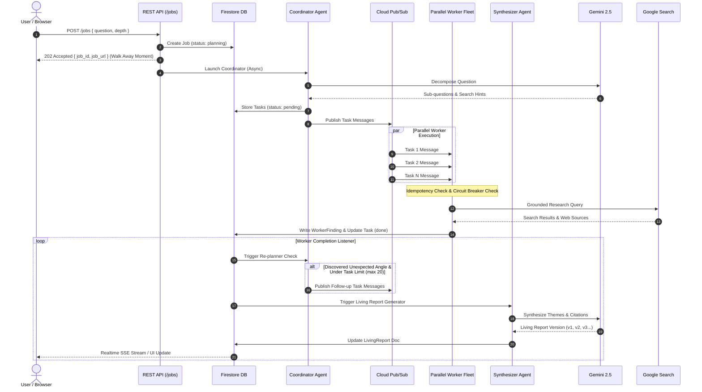

# 🐝 Research Swarm — Autonomous Multi-Agent Research Engine
> **Submission for Google Cloud + Gemini "All Things Agentic Hackathon"**

*"Research Swarm isn't just agents calling an LLM — it's a distributed system: idempotent task processing, bounded fan-out, circuit-broken external calls, and full execution tracing, built on Cloud Run + Pub/Sub + Firestore so every piece scales independently."*

---

## 🎯 Judging Criteria Mapping

| Hackathon Evaluation Theme | How Research Swarm Demonstrates It | Core Implementation Files |
| :--- | :--- | :--- |
| **Run in the Background / Async Execution** | REST endpoint `POST /jobs` creates Firestore doc & returns HTTP 202 `job_id` in <100ms ("walk away UX"). Swarm executes unattended via Cloud Run + Pub/Sub. | [`server/index.ts`](file:///c:/Users/hp/Desktop/Research%20Swarm/server/index.ts), [`server/swarm_runner.ts`](file:///c:/Users/hp/Desktop/Research%20Swarm/server/swarm_runner.ts) |
| **Heavy-Lifting of Massive Datasets** | Parallel Worker Fleet fans out across sub-questions, each independently grounding search, extracting key facts, and storing structured evidence. | [`worker/worker.ts`](file:///c:/Users/hp/Desktop/Research%20Swarm/worker/worker.ts), [`worker/search_tool.ts`](file:///c:/Users/hp/Desktop/Research%20Swarm/worker/search_tool.ts) |
| **Automate Complex Workflows Asynchronously** | Adaptive **Coordinator Re-planner** loop inspects intermediate findings, dynamically spawning follow-up research tasks when unexpected angles emerge. | [`coordinator/decomposer.ts`](file:///c:/Users/hp/Desktop/Research%20Swarm/coordinator/decomposer.ts), [`coordinator/replanner.ts`](file:///c:/Users/hp/Desktop/Research%20Swarm/coordinator/replanner.ts) |
| **Resilience, Idempotency & Backpressure** | Distributed Pub/Sub deduplication, exponential backoff retries (3x), fleet-wide Circuit Breaker (`CLOSED → OPEN → HALF_OPEN`), and hard task budget bounds (`maxTasks: 20`). | [`lib/circuit_breaker.ts`](file:///c:/Users/hp/Desktop/Research%20Swarm/lib/circuit_breaker.ts), [`worker/retry.ts`](file:///c:/Users/hp/Desktop/Research%20Swarm/worker/retry.ts), [`coordinator/replanner.ts`](file:///c:/Users/hp/Desktop/Research%20Swarm/coordinator/replanner.ts) |

---

## 🏗 Sequence & Architecture Diagram



---

## 📂 Repository Structure

```
Research Swarm/
├── lib/                   # Shared TypeScript library & resiliency
│   ├── types.ts           # Job, Task, Finding & Living Report schemas
│   ├── firestore.ts       # Cloud Firestore SDK client & fallback in-memory DB event bus
│   ├── pubsub.ts          # Cloud Pub/Sub publisher & local async fan-out bus
│   ├── gemini.ts          # Gemini SDK wrapper (Grounding + Structured Output)
│   └── circuit_breaker.ts # Shared Circuit Breaker pattern (CLOSED -> OPEN -> HALF_OPEN)
├── coordinator/           # Coordinator Agent
│   ├── decomposer.ts      # Prompt decomposition into 4-8 sub-questions
│   └── replanner.ts       # Dynamic re-planning loop + backpressure bounds
├── worker/                # Worker Agent Fleet
│   ├── search_tool.ts     # Google Search grounding tool integration
│   ├── retry.ts           # Exponential backoff retry integrated with Circuit Breaker
│   └── worker.ts          # Worker task execution, traceId logging & idempotency
├── synthesizer/           # Synthesizer Agent
│   └── generator.ts       # Living report generator with theme clustering & inline citations
├── server/                # Express REST API & Observability
│   ├── index.ts           # POST /jobs, GET /jobs/:id, GET /jobs/:id/events, GET /jobs/:id/timeline
│   └── swarm_runner.ts    # Asynchronous Swarm Orchestrator
├── frontend/              # Next.js 14 Web Application
│   ├── src/app/           # App router pages (/ and /jobs/[id])
│   └── src/components/    # High-tech glassmorphism dark theme components
├── test_swarm.ts         # Automated end-to-end verification test suite
├── SYSTEM_DESIGN.md       # Deep dive system design & consistency model documentation
├── Dockerfile             # Production Cloud Run container specification
└── README.md
```

---

## 🚀 Running Locally

### 1. Prerequisites
- Node.js v18+ and npm v10+
- (Optional) `GEMINI_API_KEY` set in `.env` (the app includes an intelligent fallback simulator so you can test end-to-end with or without an active API key).

### 2. Install & Start
```bash
# Install root dependencies
npm install

# Install frontend dependencies
cd frontend && npm install && cd ..

# Run backend API server and frontend concurrently
npm run dev
```

- **Frontend Dashboard**: `http://localhost:3000`
- **Backend API Server**: `http://localhost:4000`
- **Observability Timeline API**: `http://localhost:4000/jobs/:id/timeline`

---

## 🧪 Verification & Resilience Tests

To run the automated end-to-end multi-agent swarm test suite:
```bash
npx ts-node test_swarm.ts
```
